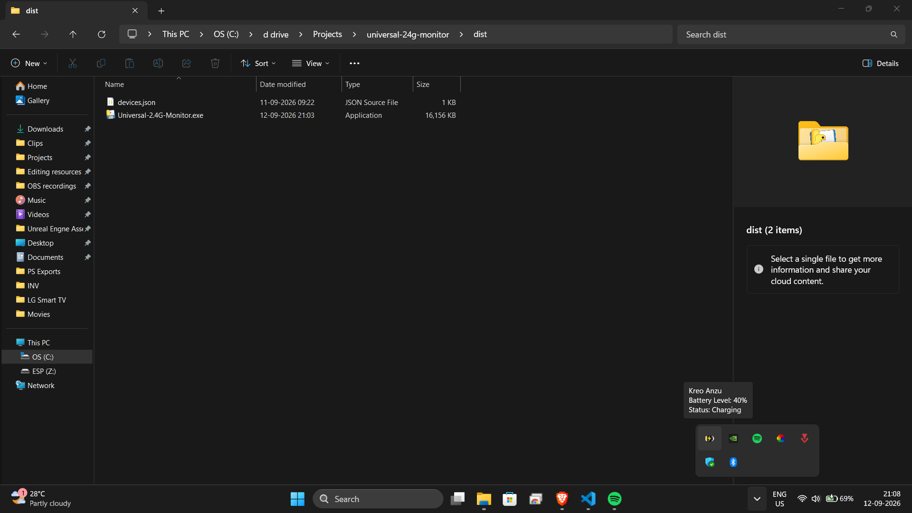
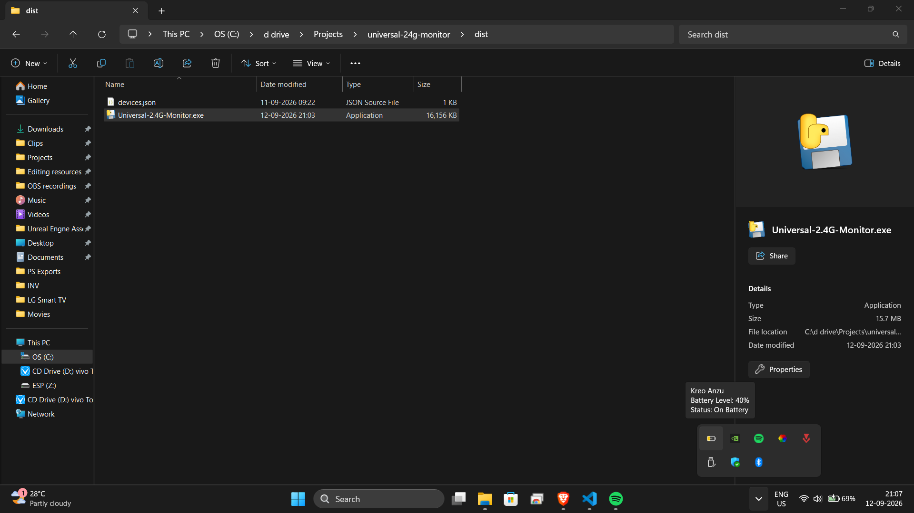
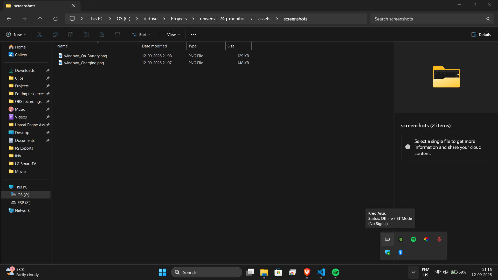

# Universal 2.4GHz Monitor 🔋

A lightweight, cross-platform battery telemetry monitor and system tray widget for 2.4GHz wireless peripherals. Built to give budget and enthusiast mice accurate battery reporting on both **Windows** and **Linux** without heavy, bloated OEM software.

---

## ⚡ Why This Exists

Most budget and midrange wireless mice (powered by CompX, Beken, or Telink microcontrollers) suffer from severe battery reporting flaws:
1. **The Charging Spike:** During USB charging, battery voltage climbs rapidly to ~4.2V, causing raw telemetry to report 100% within minutes even when the cell is nearly depleted.
2. **Missing Linux Drivers:** OEM software suites are almost exclusively Windows-only executables with zero support for Linux desktop environments or custom status bars (Waybar, Polybar).
3. **Dropped Packet Flickering:** Microcontrollers drop telemetry packets to prioritize high-polling-rate sensor tracking, causing typical tray utilities to flicker between "Connected" and "Offline".

**Universal 2.4GHz Monitor** solves these issues with:
* **Hardware State Freezing:** Intelligently locks display percentages during active charging while rendering an inline charging indicator.
* **Voltage Sag Detection:** Detects sharp discharge deltas ($\ge 10\%$) upon unplugging to immediately restore live telemetry.
* **Debounced Polling:** Suppresses false disconnections caused by intermittent wireless packet drops.
* **Zero-Privilege Security on Linux:** Relies on vendor-locked `udev` rules to prevent broad, insecure access to `/dev/hidraw*` endpoints.

---

## 🖥️ System Tray Preview & Screenshots

* **On Battery:** Renders a clean, color-coded battery gauge (Green $\rightarrow$ Amber $\rightarrow$ Red) displaying live capacity.
* **Charging:** Displays the locked pre-charge level overlaid with a high-contrast charging bolt badge.
* **Offline / Bluetooth Mode:** Safely drops to an empty standby icon when receivers enter sleep mode or switch wireless channels.

### Windows

**On Battery**  


**Charging**  


**Offline / Bluetooth Mode**  


### Linux

*(Linux preview images coming soon)*  
<!--  -->
<!--  -->
<!--  -->

---

## 🚀 Quick Start

### Windows

1. Download the latest `Universal-2.4G-Monitor.exe` and `devices.json` from the Releases tab.
2. Place `devices.json` in the same folder as `Universal-2.4G-Monitor.exe`.
3. Double-click `Universal-2.4G-Monitor.exe`. The battery icon will appear directly in your taskbar notification area.

To run automatically at boot, drop a shortcut of `Universal-2.4G-Monitor.exe` into your startup folder (`Win + R` $\rightarrow$ `shell:startup`).

---

### Linux

#### 1. System Dependencies & Hardware Permissions
To allow the system tray to render and to grant hardware access to your wireless receiver without running as `root`, run these commands:
```bash
sudo apt install libayatana-appindicator3-1 gir1.2-ayatanaappindicator3-0.1
sudo cp udev/99-universal-24g.rules /etc/udev/rules.d/
sudo udevadm control --reload-rules && sudo udevadm trigger
```
*(Note: Unplug and reconnect your 2.4GHz USB receiver after applying the udev rule.)*

#### 2. Run the App
1. Download `universal-24g-monitor-linux` and `devices.json` from the Releases tab.
2. Place both files in the same folder.
3. Make the binary executable and launch it:
```bash
chmod +x universal-24g-monitor-linux
./universal-24g-monitor-linux
```

---

## 📟 CLI & Bar Integration (Waybar / Polybar)

Query telemetry directly from your terminal:

```bash
# Print current battery status once
python cli.py -s

# Output structured JSON for Waybar / scripts
python cli.py --json
```

**JSON Output Format:**
```json
[
  {
    "name": "Kreo Anzu",
    "vendor_id": "3554",
    "battery": 78
  }
]
```

---

## 🛠️ Adding Your Mouse (`devices.json`)

Support for new devices does not require altering Python code. All hardware definitions live inside `devices.json`:

```json
{
  "compx_kreo_anzu": {
    "name": "Kreo Anzu",
    "vids": ["3554"],
    "report_id": 8,
    "length": 17,
    "payload": [8, 4, 0, 0, 0, 0, 0, 0, 0, 0, 0, 0, 0, 0, 0, 0, 73],
    "battery_index": 6
  }
}
```

### Profile Parameters
* `vids`: Array of 4-digit hexadecimal USB Vendor IDs associated with the 2.4GHz receiver.
* `payload`: The raw byte array sent to wake and query the mouse microcontroller.
* `length`: Expected byte length of the incoming HID telemetry response.
* `battery_index`: Zero-based index where the percentage byte (0-100) is stored in the response packet.

---

## 🤝 Contributing

Have a wireless peripheral not yet supported?
1. Use Wireshark with USBPcap (Windows) or `diagnose.py` (Linux) to capture the query payload and battery byte index from your receiver.
2. Add your mouse configuration to `devices.json`.
3. If on Linux, add a matching entry with your receiver's Vendor ID into `udev/99-universal-24g.rules`.
4. Open a Pull Request!

---

## 📜 License

Distributed under the MIT License. See `LICENSE` for details.